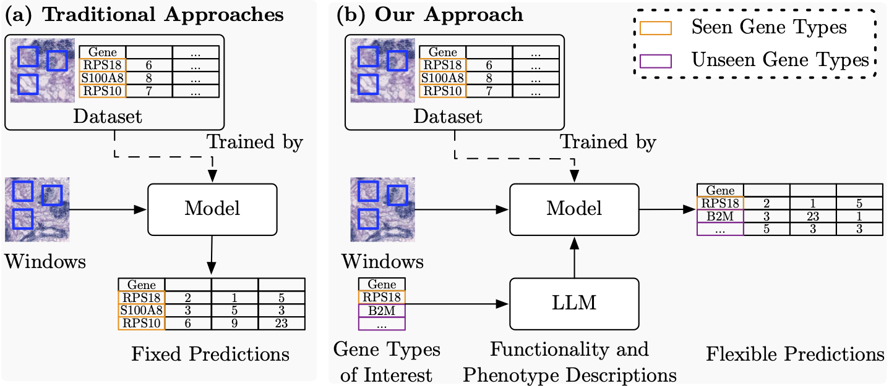

# Spatial Transcriptomics Analysis of Zero-shot Gene Expression Prediction

This repository contains the PyTorch code for our paper "Spatial Transcriptomics Analysis of Zero-shot Gene Expression Prediction".

> [paper]() | [arxiv](https://arxiv.org/pdf/2401.14772)

## Introduction
Spatial transcriptomics (ST) captures gene expression fine-grained distinct regions (i.e., windows) of a tissue slide. Traditional supervised learning frameworks applied to model ST are constrained to predicting expression of gene types seen during training from slide image windows, failing to generalize to unseen gene types. To overcome this limitation, we propose a semantic guided network, a pioneering zero- shot gene expression prediction framework. Considering a gene type can be described by functionality and phenotype, we dynamically embed a gene type to a vector per its functionality and phenotype, and employ this vector to project slide image windows to gene expression in feature space, unleashing zero-shot expression prediction for unseen gene types. The gene type functionality and phenotype are queried with a carefully designed prompt from a pre-trained large language model. On standard benchmark datasets, we demonstrate competitive zero-shot performance compared to past state-of-the-art supervised learning approaches.

<div align=center>

</div>

## Framework

<div align=center>

</div>

## Dependency
* python 3.10.13
* pytorch_lightning 1.6.4
* tifffile 2024.2.12
* Pillow 10.2.0
* scanpy 1.10.2
* torch 2.2.1+cu118

## Dataset
* Obtain [10xgenomics dataset](https://www.10xgenomics.com/resources/datasets?query=&page=1&configure%5Bfacets%5D%5B0%5D=chemistryVersionAndThroughput&configure%5Bfacets%5D%5B1%5D=pipeline.version&configure%5BhitsPerPage%5D=500&configure%5BmaxValuesPerFacet%5D=1000).

## Train SGN
* Change system directory
```bash
cd v1
```

*  Extract features and build graph
```bash

python3 extract_feature.py --file_path Please fill # Set the file_path property to the location where the downloaded data will be stored. Remember to unzip the spatial.zip file.
python3 generate_graph.py  --file_path Please fill # Set the file_path property to the location where the downloaded data will be stored. Remember to unzip the spatial.zip file.
python3 name_to_feature.py

```

* Gene expression prediction
```bash
cd ../
python3 main.py # Feel free to adjust the arguments as necessary.
```

## Contact
If you have any questions,  please drop [me](mailto:yan.yang@anu.edu.au?subject=[GitHub]SGN) an email.


## Acknowledgement
EVA-CLIP is built using the awesome [timm](https://github.com/huggingface/pytorch-image-models).

## Citation

```

@article{yang2024spatialtranscriptomicsanalysiszeroshot,
      title={Spatial Transcriptomics Analysis of Zero-shot Gene Expression Prediction}, 
      author={Yan Yang and Md Zakir Hossain and Xuesong Li and Shafin Rahman and Eric Stone},
      year={2024},
      eprint={2401.14772},
      archivePrefix={arXiv},
      primaryClass={cs.CV},
      url={https://arxiv.org/abs/2401.14772}, 
}
